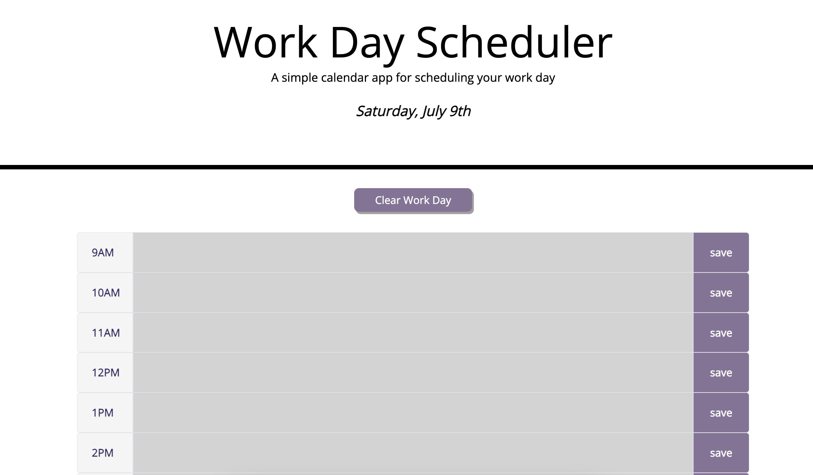

# Work-Day-Scheduler

## Description

This week's challenge was to create a simple calendar application that allows a user to save events for each hour of the day. This app is running in the browser and feature dynamically updated HTML and CSS powered by jQuery.

The main acceptance criteria were as follow:

- When I open the planner then the current day is displayed at the top of the calendar
- Iclude time blocks for standard business hours
- When I view the time blocks for that day then each time block is color-coded to indicate whether it is in the past, present, or future
- When I click into a time block then I can enter an event
- When I click the save button for that time block then text for that event is saved in local storage and persist when I refresh the page

## What I learned

For this challenge I have deepened the JQuery knowledge I gained during class. Using a different synthax can be a little tricky and making sure that this synthax is used consistently is a lesson I have learned!

## Challenges

The main challenge for this project was comfortably using JQuery synthax throughout all the code. Since I have only been using vanilla Javascript until this project, making sure that all the code you are writing is using the correct synthax was a little tricky. A few oversights meant that some functions were not working properly but coming back to the challenge with fresh eyes helped in making sure that vanilla javascript was changed for JQuery!

### Link to deployed page

https://appolinefr.github.io/Work-Day-Scheduler/

#### Screenshot of deployed page

